# Python Executor Dashboard

A modern, interactive web-based dashboard for executing Python scripts with real-time progress tracking, comprehensive logging, and execution history management.

## Features

✨ **Interactive Dashboard**
- Real-time script execution monitoring
- Live progress tracking with visual progress bar
- User context tracking for each execution
- Status badges (pending, running, success, failed)

📊 **Comprehensive Logging**
- Real-time log streaming during execution
- Complete log history for each task
- Download logs as text files
- Copy logs to clipboard functionality

⏱️ **Task Management**
- Full execution history with timestamps
- Sort and filter tasks
- Quick task details view
- Task duration tracking

🎨 **Modern UI**
- Dark theme with gradient accents
- Fully responsive design
- Smooth animations and transitions
- Mobile-friendly interface

## Project Structure

```
py-executor-dashboard/
├── backend/
│   ├── app.py                 # Flask application
│   ├── executor.py            # Task execution engine
│   ├── sample_script.py       # Sample executable script
│   └── logs/                  # Execution logs storage
├── frontend/
│   ├── templates/
│   │   └── index.html         # Main dashboard UI
│   └── static/
│       ├── style.css          # Dashboard styles
│       └── script.js          # Client-side logic
├── requirements.txt           # Python dependencies
└── README.md                  # This file
```

## System Architecture

### Workflow Diagram


### Component Interaction


### Execution Flow


### Data Flow

```mermaid
graph TB
    A["📝 User Form<br/>(Name + Script Type)"] -->|Raw Input| B["🔄 Validation<br/>(Backend)"]
    B -->|✅ Valid| C["📦 Task Creation<br/>(Unique ID)"]
    C -->|Task Object| D["⚙️ Script Executor<br/>(Threading)"]
    D -->|Output Stream| E["📄 Log File<br/>(File System)"]
    D -->|Status Update| F["💾 Task State<br/>(In-Memory)"]
    E -->|Read on Demand| G["🌐 REST API<br/>(/api/tasks/logs)"]
    F -->|JSON Response| G
    G -->|WebSocket/Poll| H["🎨 Dashboard UI<br/>(Real-time)"]
    H -->|Display| I["👁️ User Views<br/>(Progress + Logs)"]
```



## Installation & Setup

### Prerequisites
- Python 3.8+
- pip (Python package manager)
- Modern web browser

### Step 1: Clone the Repository
```bash
git clone https://github.com/mrsrujankv/py-executor-dashboard.git
cd py-executor-dashboard
```

### Step 2: Create Virtual Environment
```bash
# macOS/Linux
python3 -m venv venv
source venv/bin/activate

# Windows
python -m venv venv
venv\Scripts\activate
```

### Step 3: Install Dependencies
```bash
pip install -r requirements.txt
```

### Step 4: Run the Application
```bash
cd backend
python app.py
```

The dashboard will be available at: **http://localhost:5000**

## Usage Guide

### Executing a Script

1. **Enter Your Name**: Input your username in the "User Name" field
2. **Select Script**: Choose "Sample Script" from the dropdown
3. **Add Arguments** (Optional): Enter any command-line arguments
4. **Click Execute**: Press the "Execute Script" button

### Monitoring Execution

- **Progress Bar**: Shows real-time execution progress (0-100%)
- **Status Badge**: Displays current task status:
  - 🟡 **PENDING**: Task queued, waiting to start
  - 🔵 **RUNNING**: Task is currently executing
  - 🟢 **SUCCESS**: Task completed successfully
  - 🔴 **FAILED**: Task execution failed

### Viewing Logs

- **Real-time Logs**: Logs appear in the "Execution Logs" panel as the script runs
- **Refresh Logs**: Click the "🔄 Refresh" button to fetch latest logs
- **Copy Logs**: Click "📋 Copy" to copy logs to clipboard
- **Download Logs**: Click "⬇️ Download" to save logs as a text file

### Task History

The "Task History" table shows:
- **Task ID**: Unique identifier (truncated for display)
- **User**: Name of the user who executed the task
- **Status**: Current status with visual indicator
- **Progress**: Progress bar showing execution percentage
- **Created At**: Timestamp when task was created
- **Actions**: View and copy options

## API Reference

### Execute Script
**Endpoint**: `POST /api/execute`

Request:
```json
{
  "user_name": "John Doe",
  "script_type": "sample",
  "args": ["arg1", "arg2"]
}
```

Response:
```json
{
  "success": true,
  "task": {
    "id": "uuid-string",
    "user_name": "John Doe",
    "status": "running",
    "progress": 0,
    "created_at": "2024-11-16T10:30:00",
    "started_at": "2024-11-16T10:30:01",
    "completed_at": null,
    "output": "",
    "error": ""
  }
}
```

### Get All Tasks
**Endpoint**: `GET /api/tasks`

Response:
```json
{
  "success": true,
  "tasks": [
    { /* task object */ },
    { /* task object */ }
  ]
}
```

### Get Task Details
**Endpoint**: `GET /api/tasks/<task_id>`

Response:
```json
{
  "success": true,
  "task": { /* task object */ }
}
```

### Get Task Logs
**Endpoint**: `GET /api/tasks/<task_id>/logs`

Response:
```json
{
  "success": true,
  "logs": "Task output and logs...\n"
}
```

### Health Check
**Endpoint**: `GET /api/health`

Response:
```json
{
  "status": "healthy"
}
```

## Task Object Structure

```json
{
  "id": "550e8400-e29b-41d4-a716-446655440000",
  "user_name": "John Doe",
  "script_path": "/path/to/sample_script.py",
  "args": [],
  "status": "success",
  "progress": 100,
  "created_at": "2024-11-16T10:30:00.123456",
  "started_at": "2024-11-16T10:30:01.234567",
  "completed_at": "2024-11-16T10:30:15.345678",
  "output": "Script output logs...",
  "error": "",
  "return_code": 0,
  "log_file": "logs/550e8400-e29b-41d4-a716-446655440000.log"
}
```

## Creating Custom Scripts

### Example Custom Script

Create a file in the `backend/` directory:

```python
# backend/my_script.py
import time
from datetime import datetime

def main():
    print(f"[{datetime.now().strftime('%Y-%m-%d %H:%M:%S')}] Starting custom script...")
    
    for i in range(1, 6):
        print(f"[{datetime.now().strftime('%Y-%m-%d %H:%M:%S')}] Step {i}/5")
        time.sleep(1)
    
    print(f"[{datetime.now().strftime('%Y-%m-%d %H:%M:%S')}] ✓ Done!")
    return 0

if __name__ == "__main__":
    import sys
    exit_code = main()
    sys.exit(exit_code)
```

### Register Script in Backend

In `backend/app.py`, add the script option:

```python
# Add import
from pathlib import Path

# In execute_script() function, add:
elif script_type == "custom":
    script_path = str(BACKEND_DIR / "my_script.py")
```

### Update Frontend

In `frontend/templates/index.html`, add option to select:

```html
<option value="custom">Custom Script</option>
```

## Configuration

### Adjust Log Directory
In `backend/executor.py`:
```python
executor = TaskExecutor(logs_dir="custom_logs_path")
```

### Change Flask Host/Port
In `backend/app.py`:
```python
app.run(debug=True, host="0.0.0.0", port=8080)
```

### Adjust Refresh Interval
In `frontend/static/script.js`:
```javascript
const REFRESH_INTERVAL = 500; // 500ms instead of 1000ms
```

## Troubleshooting

### Issue: Port 5000 already in use
**Solution**: Change port in `backend/app.py`
```python
app.run(debug=True, host="0.0.0.0", port=5001)
```

### Issue: Script permissions denied
**Solution**: Make script executable
```bash
chmod +x backend/sample_script.py
```

### Issue: No logs appearing
**Solution**: Check that logs directory exists and is writable
```bash
mkdir -p backend/logs
chmod 755 backend/logs
```

### Issue: Dashboard not updating
**Solution**: Check browser console for errors (F12), verify API endpoint is correct

## Security Considerations

⚠️ **Production Deployment Notes**:

1. **Input Validation**: The app validates user names but should add more checks for production
2. **Script Execution**: Only allow specific scripts to be executed for security
3. **Authentication**: Add user authentication before allowing script execution
4. **Authorization**: Implement role-based access control
5. **Rate Limiting**: Add rate limiting to prevent abuse
6. **HTTPS**: Use HTTPS in production
7. **CORS**: Configure CORS properly for your domain

## Performance Optimization

- **Threading**: Task execution uses threading to avoid blocking the API
- **Caching**: Task history is kept in-memory for fast retrieval
- **Polling**: Frontend uses polling instead of WebSockets for simplicity
- **Lazy Loading**: Logs are loaded on-demand, not on page load

## Development

### Running in Debug Mode
The app runs in debug mode by default. Disable for production:
```python
app.run(debug=False)
```

### Adding Logging
Install logging library:
```bash
pip install python-logging
```

Add to `backend/app.py`:
```python
import logging
logging.basicConfig(level=logging.DEBUG)
logger = logging.getLogger(__name__)
```

## Future Enhancements

📋 **Planned Features**:
- [ ] WebSocket support for real-time updates
- [ ] User authentication and authorization
- [ ] Database persistence (SQLite, PostgreSQL)
- [ ] Email notifications on task completion
- [ ] Task scheduling/cron support
- [ ] Advanced filtering and search in task history
- [ ] Performance metrics and analytics
- [ ] Docker containerization
- [ ] Kubernetes deployment configs
- [ ] API documentation (Swagger/OpenAPI)

## License

MIT License - feel free to use this project for personal or commercial use.

## Support

For issues, questions, or suggestions:
- Create an issue on GitHub
- Email: support@example.com
- Documentation: Check the API Reference section above

## Version History

**v1.0.0** (2024-11-16)
- Initial release
- Task execution with progress tracking
- Real-time log streaming
- Task history management
- Interactive dashboard UI

---

**Built with ❤️ using Flask, Python, and modern web technologies**